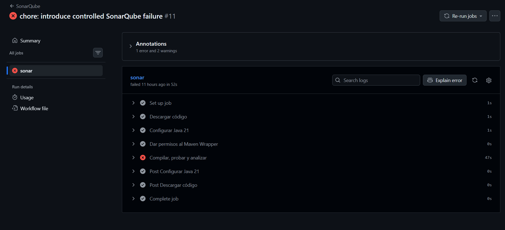
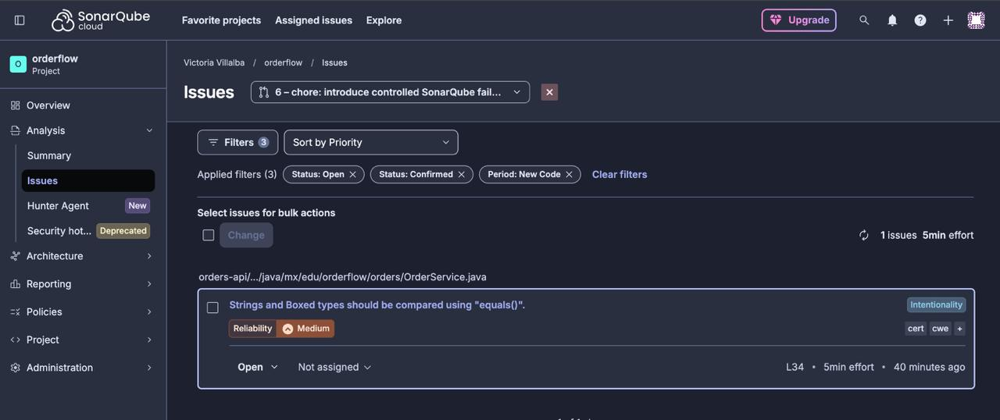
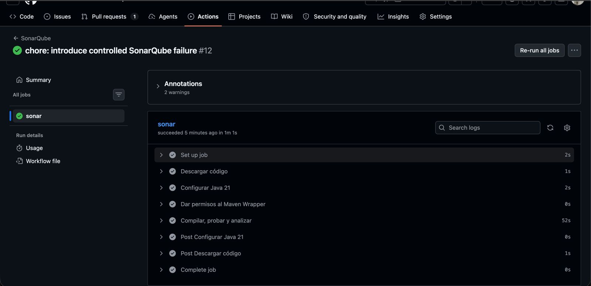
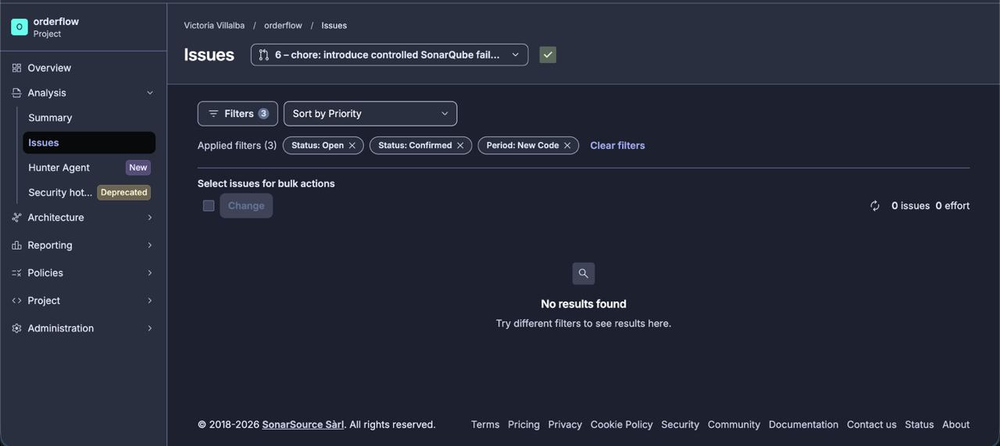

# Evidencia Unidad 1 - GitHub Actions y SonarQube

## 1. Identificación 

- Equipo: Programitos
- Integrantes: 
    - Juan Pablo Heras Carrazco
    - Pedro Morales Esquer
    - Victoria Isabel Villalba Beltrán
    - Pablo Emilio Zamora Gámez
- Proyecto: Orderflow
- Repositorio: https://github.com/vikvillalba/orderflow-devops


## 2. Flujo de integración

El proyecto utilizará GitHub Actions para ejecutar el build, las pruebas, generar el reporte de las mismas con JaCoCo y ejecutar el análisis de SonarQube.

Flujo:

Push hacia main / Pull Request -> GitHub Actions -> Maven + Tests -> JaCoCo -> SonarScanner -> SonarQube -> Quality Gate


Como el equipo decidió trabajar con la versión gratuita de SonarQube se utilizará el Quality Gate que viene incluido por default con el plan gratuito `Sonar Way`.

## 3. Ejecución base

Antes de provocar el fallo controlado se verificó que el proyecto pudiera completar correctamente el pipeline:

- Commit: aef86e6
- Run de GitHub Actions: https://github.com/vikvillalba/orderflow-devops/actions/runs/34807503245
- Resultado: Pass
- Quality Gate: Passed

*Dentro del YAML para configurar GitHub Actions se configuró que si SonarQube fallaba, entonces también fallaría el workflow de GitHub Actions*

## 4. Predicción del fallo controlado

Se decidió introducir intencionalmente una comparación incorrecta de Strings mediante el operador `==` en lugar de con el método `.equals()`

Código introducido: 

```java
public synchronized boolean isValidStatus(String status) {
    return "ACTIVE" == status;
}
```

Se esperaba que SonarQube identificara esta comparación como fallo / bug ya que `==` compara referencias de objetos y no el contenido.


## 5. Ejecución con fallo
- Commit del fallo: 39bf0dd
- Run de GitHub Actions: https://github.com/vikvillalba/orderflow-devops/actions/runs/34808567352
- Análisis SonarQube: https://sonarcloud.io/summary/new_code?id=vikvillalba_orderflow-devops&pullRequest=6
- Quality Gate y workflow GitHub Actions: FAILED
- Evidencia en Github Actions:

- Evidencia en SonarQube Cloud:


SonarQube mostró el error: 

    Strings and Boxed types should be compared using "equals()"

## 6. Correción
El problema se corrigió cambiando:

```java
"ACTIVE" == status
```

```java
"ACTIVE".equals(status)
```

Con la nueva opción se compara el contenido del String en lugar de su referencia. 

## 7. Ejecución después de la correción
- Commit: d6b49df
- Run de GitHub Actions: https://github.com/vikvillalba/orderflow-devops/actions/runs/34811223573
- Análisis de SonarQube: https://sonarcloud.io/project/issues?id=vikvillalba_orderflow-devops&pullRequest=6&s=IMPACT_RANK&sinceLeakPeriod=true&issueStatuses=OPEN%2CCONFIRMED
- QualityGate: Passed
- Evidencia en Github Actions:

- Evidencia en SonarQube Cloud:


## 8. Uso de IA
### Prompts de referencia utilizados en Claude
- **Estructura del archivo YAML:** 
    > "Ayúdame a estructurar un workflow de GitHub Actions para un proyecto con Java 21 y Maven Wrapper. Necesito que analice todo el código, enviando las métricas a SonarCloud y evalue las Quality Gates"

    ### Respuesta:
    ```yaml
     name: SonarQube

     on:
       push:
         branches: [main]
       pull_request:
         branches: [main]

     jobs:
       sonar:
         runs-on: ubuntu-latest

         steps:
           - name: Descargar código
             uses: actions/checkout@v4
             with:
               fetch-depth: 0

           - name: Configurar Java 21
             uses: actions/setup-java@v4
             with:
               distribution: temurin
               java-version: '21'
               cache: maven

           - name: Dar permisos al Maven Wrapper
             run: chmod +x mvnw

           - name: Compilar, probar y analizar
             env:
               SONAR_TOKEN: ${{ secrets.SONAR_TOKEN }}
             run: >
               ./mvnw -B clean verify
               org.sonarsource.scanner.maven:sonar-maven-plugin:sonar
               -Dsonar.organization=${{ vars.SONAR_ORGANIZATION_KEY }}
               -Dsonar.projectKey=${{ vars.SONAR_PROJECT_KEY }}
               -Dsonar.qualitygate.wait=true
     ```

- **Comprensión de parámetros y atributos del YAML:** 
    > "¿Para qué funciona cada atributo en el archivo `sonar.yml`? Explícame específicamente qué hacen `fetch-depth: 0`, `on: [pull_request]`, y la propiedad `-Dsonar.qualitygate.wait=true`"

  ### Respuesta:
    > * "**`fetch-depth: 0`:** Configura `actions/checkout` para descargar el historial completo de commits de Git en lugar de un *shallow clone*. Esto es indispensable para que SonarCloud compare el código nuevo (*New Code*) contra la rama `main` y asigne autorías de cambios."
    > * "**`on: [pull_request, push]`:** Define los eventos disparadores. `pull_request` valida los cambios en ramas secundarias antes del *merge*, mientras que `push` actualiza la métrica base del proyecto en la rama principal."
    > * "**`-Dsonar.qualitygate.wait=true`:** Es la clave de la sincronización en CI/CD. Pausa la ejecución de Maven en GitHub Actions esperando el veredicto de SonarCloud. Si el Quality Gate arroja **FAILED**, el paso en GitHub Actions falla con una **X roja**, bloqueando el proceso."
    > * "**`cache: maven`:** Almacena en caché las dependencias `.m2` para acelerar el tiempo de construcción de futuros ejecuciones."
    > * "**`distribution: temurin`:** Especifica el proveedor de OpenJDK a instalar en la máquina virtual de GitHub. Es una distribución gratuita de alto rendimiento, ideal para compilar y probar aplicaciones Java 21 en entornos CI/CD."